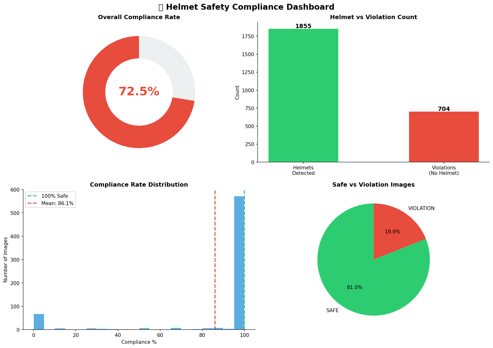

# ⛑️ Computer Vision-Based PPE Compliance Detection System

> YOLOv8 object detection model trained to identify helmet compliance in construction site imagery, with automated safety reporting and REST API deployment.


---

## 1. Introduction

This project implements an automated PPE (Personal Protective Equipment) compliance detection system using the YOLOv8 object detection architecture. The system processes construction site images to identify workers wearing helmets versus those without, generates per-image compliance scores, and exposes detection capabilities through a REST API.

The pipeline covers the full ML lifecycle: dataset acquisition, model training, evaluation, batch inference, analytics reporting, and API deployment.

---

## 2. Business Understanding

| | |
|---|---|
| **Business Problem** | Construction and industrial sites are legally required to ensure all workers wear helmets at all times. Manual inspection by safety officers is unreliable (human error, fatigue, limited coverage) and cannot monitor multiple zones simultaneously — resulting in frequent safety violations and regulatory non-compliance. |
| **Business Objective** | Train a high-accuracy computer vision model that automatically detects helmet presence/absence in site images and video frames — providing reliable, scalable, and objective safety compliance monitoring. |
| **Business Constraint** | Model must work on real-world construction site images with variable lighting, angles, and crowd density; must achieve high precision to avoid false violation alerts that waste safety officer time; must be lightweight enough to run on edge devices or affordable cloud infrastructure. |
| **Business Success Criteria** | Model correctly identifies helmet compliance status for all workers in a site image with ≥ 94% accuracy — producing compliance reports that safety managers can use for regulatory documentation. |
| **ML Success Criteria** | YOLOv8 model achieves mAP50 ≥ 94% for helmet class and ≥ 90% for head (no-helmet) class on validation set of 1,413 images. |
| **Economic Success Criteria** | Automated detection reduces safety inspection costs by 50–60%. Avoiding a single OSHA-equivalent violation fine (avg $15,000) covers the annual cost of running the system multiple times over. Insurance premium reductions for compliant sites provide additional economic benefit. |

## 3. Problem Statement

Manual PPE inspection at construction sites is labor-intensive, inconsistent, and unable to scale across multiple camera feeds simultaneously. The objective of this project is to automate helmet compliance detection using computer vision, enabling:

- Automated identification of helmet vs. no-helmet instances
- Per-image compliance percentage scoring
- Structured violation logging for audit purposes
- An API endpoint for integration with downstream safety systems

---

## 4. Dataset Description

| Field | Details |
|---|---|
| Source | Hard Hat Workers Dataset — Roboflow Universe |
| License | Public Domain |
| Total Images | ~5,000 |
| Training Set | 3,396 images |
| Validation Set | 1,413 images |
| Annotation Format | YOLO bounding boxes |
| Number of Classes | 3 |

### Class Definitions

| Class | Label | Description |
|---|---|---|
| 0 | `head` | Human head without helmet — violation |
| 1 | `helmet` | Head with helmet — compliant |
| 2 | `person` | Full body person — contextual |

### Class Distribution (Validation Set)
- helmet: 3,913 instances
- head: 1,339 instances
- person: 101 instances

> The `person` class is significantly underrepresented, which affects its detection performance. This is acknowledged as a dataset limitation.

---

## 5. Model Architecture

The model is based on **YOLOv8n (nano)** from the Ultralytics framework — the smallest and fastest variant of the YOLOv8 family.

### Architecture Summary
- **Backbone:** CSPDarknet with C2f modules
- **Neck:** PANet (Path Aggregation Network)
- **Head:** Decoupled detection head
- **Parameters:** 3,006,233
- **GFLOPs:** 8.1
- **Input Size:** 640 × 640
- **Output:** Bounding boxes with class probabilities

YOLOv8n was selected over larger variants (s, m, l, x) to balance inference speed with accuracy, given the relatively small number of classes and high-contrast visual distinction between helmet and no-helmet cases.

---

## 6. Training Setup

### Hardware
- **Platform:** Google Colab
- **GPU:** NVIDIA Tesla T4 (14,913 MiB VRAM)
- **Framework:** PyTorch 2.10.0 + CUDA 12.8

### Hyperparameters
```python
model = YOLO('yolov8n.pt')  # pretrained COCO weights
model.train(
    data='data.yaml',
    epochs=50,
    imgsz=640,
    batch=16,
    device='cuda',
    patience=10        # early stopping
)
```

### Training Details
- **Pretrained weights:** YOLOv8n trained on COCO (transfer learning)
- **Epochs completed:** 50
- **Total training time:** 1.353 hours
- **Optimizer:** AdamW (auto-selected by Ultralytics)
- **Early stopping patience:** 10 epochs

---

## 7. Performance Metrics

### Validation Results (best.pt)

| Class | Images | Instances | Precision | Recall | mAP50 | mAP50-95 |
|---|---|---|---|---|---|---|
| **all** | 1,413 | 5,353 | 0.649 | 0.658 | 0.660 | 0.466 |
| **head** | 256 | 1,339 | 0.901 | 0.950 | **0.964** | 0.678 |
| **helmet** | 1,297 | 3,913 | 0.942 | 0.955 | **0.982** | 0.698 |
| person | 32 | 101 | 0.104 | 0.069 | 0.035 | 0.021 |

### Inference Speed (Tesla T4)
- Preprocessing: 0.2ms
- Inference: 1.8ms
- Postprocessing: 1.8ms

### Key Observations
- Helmet and head classes achieve near-perfect mAP50 (96–98%), suitable for deployment
- Person class underperforms due to severe class imbalance (101 instances vs 3,913 for helmet)
- Overall mAP50 (0.660) is suppressed by the person class — primary use-case metrics (helmet/head) are significantly higher

---

## 8. Deployment Architecture

```
Client (image upload)
        ↓
FastAPI Application (uvicorn server)
        ↓
YOLOv8 Inference (best.pt loaded in memory)
        ↓
Post-processing: class counts + compliance calculation
        ↓
JSON Response: status, compliance%, detections[]
```

### API Endpoints

| Method | Endpoint | Description |
|---|---|---|
| GET | `/` | API status, model metadata |
| POST | `/predict` | Upload image → detection results |
| GET | `/stats` | Aggregate batch processing statistics |
| GET | `/health` | Service health check |

### Sample Response — POST /predict
```json
{
  "status": "SAFE",
  "compliance_%": 100,
  "helmet_count": 11,
  "violations": 0,
  "total_detections": 11,
  "detections": [
    {
      "class": "helmet",
      "confidence": 0.866,
      "bbox": [366, 74, 399, 118]
    }
  ],
  "timestamp": "2026-03-03 16:37:08"
}
```

### Running the API
```bash
pip install fastapi uvicorn python-multipart ultralytics
uvicorn app:app --reload
# Swagger docs: http://127.0.0.1:8000/docs
```

---

## 9. Results & Business Impact

### Batch Detection — 706 Test Images



| Metric | Value |
|---|---|
| Images processed | 706 |
| Total helmets detected | 1,855 |
| Total violations (no helmet) | 704 |
| Overall compliance rate | 72.49% |
| Images fully compliant | 81.0% |
| Images with violations | 19.0% |
| Mean per-image compliance | 86.1% |

### Compliance Score Formula
```
compliance% = (helmet_count / (helmet_count + head_count)) × 100
```

### Output Format
Each processed image is annotated with:
- Green bounding boxes for compliant workers (helmet detected)
- Red bounding boxes for violations (head without helmet)
- Compliance percentage and SAFE/VIOLATION status overlay

A CSV report (`safety_report.csv`) is generated containing per-image metrics, timestamps, and status labels for downstream audit use.

---

## 10. Limitations

- **Person class underperforms** due to severe class imbalance in training data; full-body person detection is unreliable
- **Context-unaware detection** — the model flags heads in office/meeting room settings as violations even where helmets are not required
- **Static image inference only** — real-time video stream processing is not implemented in the current version
- **Single camera perspective** — occlusion in crowded scenes may cause missed detections
- **No re-identification** — the same worker may be counted multiple times across frames or images
- **Model size** — YOLOv8n trades accuracy for speed; larger variants (YOLOv8m/l) would improve mAP at the cost of inference time

---

## 11. Future Work

- Implement video stream inference using OpenCV `VideoCapture` for real-time CCTV monitoring
- Retrain with additional `person` class annotations to improve full-body detection
- Add zone-based compliance rules (helmet required only in designated zones)
- Explore YOLOv8s or YOLOv8m for improved accuracy if latency permits
- Implement worker re-identification to avoid duplicate counting
- Add alert system (email/SMS) triggered on violation threshold breach
- Deploy to cloud infrastructure (AWS EC2 / GCP Compute Engine) for multi-site access
- Extend PPE classes: safety vest, gloves, safety glasses

---

## 🛠 Tools & Technologies

- **YOLOv8 (Ultralytics)** — Object detection training and inference
- **Google Colab + Tesla T4** — GPU-accelerated training environment
- **OpenCV** — Image I/O and bounding box annotation
- **FastAPI + Uvicorn** — REST API framework and ASGI server
- **Roboflow** — Dataset hosting and YOLO-format export
- **matplotlib + pandas** — Analytics dashboard and CSV reporting
- **PyTorch** — Underlying deep learning framework

---

## 📂 Project Structure

```
helmet-safety-detection/
│
├── Hard-Hat-Workers-1/           # Dataset (train/valid/test splits)
├── training_results/             # Training curves, confusion matrix
├── output/                       # Annotated output images
│
├── best.pt                       # Best trained YOLOv8 weights
├── detect.py                     # Batch inference + CSV export script
├── analytics.py                  # Dashboard generation script
├── app.py                        # FastAPI application
├── safety_report.csv             # Per-image detection results
├── safety_dashboard.png          # Compliance analytics dashboard
└── README.md
```

---

## ▶️ How to Run

```bash
# Install dependencies
pip install ultralytics opencv-python pandas fastapi uvicorn python-multipart

# Run batch detection
python detect.py

# Generate analytics dashboard
python analytics.py

# Start API server
uvicorn app:app --reload
```

---

## 👤 Author

**Syed Kafeel Ahamed**

Finance professional with 6+ years of accounting experience transitioning into Data Analytics and Computer Vision.

🔗 [LinkedIn](https://www.linkedin.com/in/syed-kafeel-ahamed-ab465036b) | [GitHub](https://github.com/ahamedkafeel22)
